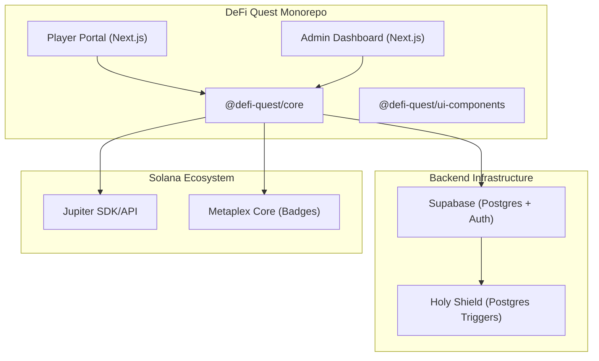

# DeFi Quest Engine

[](https://solana.com)
[](https://jup.ag)
[](https://opensource.org/licenses/MIT)

The DeFi Quest Engine is a production-grade, white-label framework for building gamified mission systems on Solana. It deep-links into the Jupiter ecosystem to transform standard DeFi actions into an immersive, narrative-driven experience.

[**Architecture**](#architecture) | [**Features**](#core-features) | [**Quick Start**](#quick-start) | [**Security**](#database-integrity--the-holy-shield)

---

## Architecture

The project is structured as a Turbo-powered monorepo, separating core logic from frontend interfaces to ensure flexibility and scalability.



---

## Core Features

### The Player Portal
A high-fidelity, Matrix-themed interface designed for maximum user engagement.
- **Narrative Quests**: Progress through mission chains linked to real-time DeFi actions.
- **The Forge**: A gamified crafting system where users can combine "Soul Fragments" (Badges) to generate rare variants.
- **AI Overseer**: Integration with Groq-powered agents to generate dynamic mission descriptions and rare NFT variants.

### The Admin Dashboard
A comprehensive command center for dApp operators.
- **Mission Builder**: Visual interface for creating and managing quest parameters.
- **Prophecy Orchestration**: Automated market data fetching and prophecy generation.
- **Real-time Analytics**: Monitor user progress and completion rates across the ecosystem.

### Database Integrity: The "Holy Shield"
To ensure user progress is never lost, the engine implements advanced Postgres-level protection:
- **State Guard Triggers**: Database triggers that detect and block destructive state resets (e.g., accidental 0-XP assignments).
- **Service Role Verification**: Critically sensitive ops are isolated to trusted backend services.
- **Real-time Sync**: Automatic state propagation via Supabase Realtime during swaps and stakes.

---

## Quick Start

### Prerequisites
- Node.js >= 20
- npm or pnpm
- A Supabase project

### Installation
1. Clone the repository:
```bash
git clone https://github.com/your-username/defi-quest-engine.git
cd defi-quest-engine
```

2. Install dependencies:
```bash
npm install
```

3. Configure Environment Variables:
Copy `.env.example` (or refer to the list below) into `packages/player-portal/.env.local` and `packages/admin-dashboard/.env.local`.

### Running Locally
- **Player Portal**: `npm run dev:play` (Access at http://localhost:3002)
- **Admin Dashboard**: `npm run dev:admin` (Access at http://localhost:3001)
- **Core Package**: `npm run dev`

---

## Environment Configuration

| Variable | Description | Location |
|----------|-------------|----------|
| `NEXT_PUBLIC_SUPABASE_URL` | Your Supabase project URL | All |
| `NEXT_PUBLIC_SUPABASE_ANON_KEY` | Public anonymous key | All |
| `SUPABASE_SERVICE_ROLE_KEY` | Private service role key | Backend Only |
| `NEXT_PUBLIC_SOLANA_RPC` | Solana RPC endpoint | All |
| `GROQ_API_KEY` | API Key for AI variant generation | Admin/Portal |
| `NEXT_PUBLIC_REOWN_PROJECT_ID` | WalletConnect/Reown Project ID | Portal |

---

## Performance & Scaling
- **Vercel Optimized**: Fully compatible with Vercel deployment and edge functions.
- **Metaplex Core**: Uses the most efficient NFT standard on Solana to minimize minting costs.
- **Turbo Repo**: Optimized build times and managed dependencies for local development.

---

## License
MIT License. Built for the Jupiter Mobile ecosystem and the Solana community.
