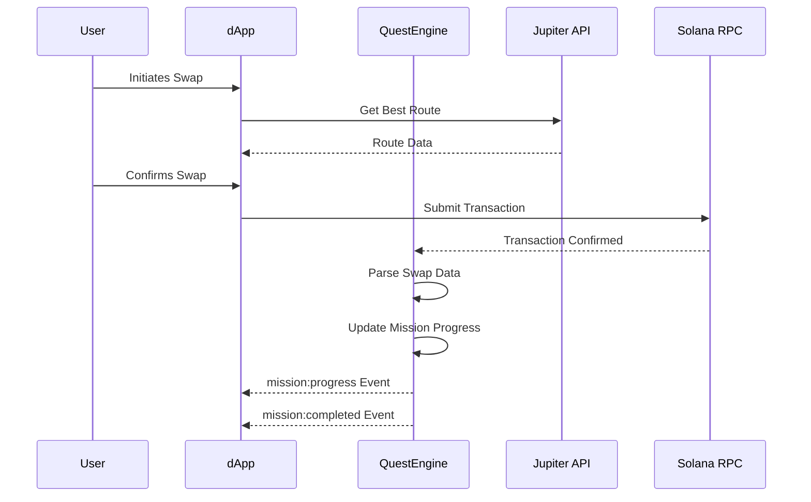

# 🎮 DeFi Quest Engine

<div align="center">


[](https://opensource.org/licenses/MIT)
[](https://solana.com)
[](https://jup.ag)

### **White-label mission/quest system for Solana dApps**

*Turn boring DeFi into addictive games with Jupiter Mobile integration*

[**Live Demo**](#-live-demo) • [**Documentation**](#-documentation) • [**Quick Start**](#-quick-start) • [**Examples**](#-example-integrations)

</div>

---

## 🎬 Live Demo

| Demo | Description | Link |
|------|-------------|------|
| 🌐 **Landing Page** | Product showcase | **[View Live →](https://defi-quest-home.netlify.app)** |
| 🎛️ **Admin Dashboard** | Mission management | **[View Live →](https://defi-quest-dashboard.netlify.app)** |
| 🔄 **Simple Swap dApp** | Quest integration demo | [View Demo](./examples/simple-dapp/index.html) |
| 📊 **DeFi Dashboard** | Portfolio + quests | [View Demo](./examples/defi-dashboard/) |
| 🎮 **Gaming dApp** | Clicker game example | [View Demo](./examples/gaming-dapp/) |

> **📹 Video Walkthrough:** [Coming Soon - Record your 90-second demo]

---

## 🏗️ Architecture

```mermaid
flowchart TB
    subgraph SDK["@defi-quest SDK"]
        Core["@defi-quest/core"]
        UI["@defi-quest/ui-components"]
    end

    subgraph Core
        QE[QuestEngine]
        ME[MissionEngine]
        SV[SwapVerifier]
        SM[StreakManager]
        RC[RewardCalculator]
    end

    subgraph UI
        ML[quest-mission-list]
        NT[quest-notification-toast]
        LB[quest-leaderboard]
    end

    subgraph External["External Services"]
        JUP[Jupiter API]
        SOL[Solana RPC]
        SUP[Supabase]
    end

    subgraph dApp["Your dApp"]
        APP[Any Solana dApp]
    end

    APP --> Core
    APP --> UI
    Core --> JUP
    Core --> SOL
    Core --> SUP
    QE --> ME
    QE --> SV
    QE --> SM
    QE --> RC

    style SDK fill:#1a1a2f,stroke:#00ffff,stroke-width:2px
    style Core fill:#14141f,stroke:#7c3aed,stroke-width:2px
    style UI fill:#14141f,stroke:#C7F284,stroke-width:2px
    style External fill:#0a0a0f,stroke:#8888aa,stroke-width:1px
    style dApp fill:#14141f,stroke:#ff006e,stroke-width:2px
```



---

## ✨ Features

<table>
<tr>
<td width="50%">

### 🎯 Mission System
- **Swap Missions** - Single swap requirements
- **Volume Missions** - Cumulative trading volume
- **Streak Missions** - Consecutive day activity
- **Limit Order Missions** - Jupiter Trigger API
- **DCA Missions** - Jupiter Recurring API
- **Price/Routing Missions** - Advanced conditions

</td>
<td width="50%">

### 🔌 Jupiter & Tier 1 Stack
- **Jupiter V6 SDK** - Official high-performance integration
- **Metaplex Core** - Programmable badge NFTs (Low cost/High speed)
- **Mobile Wallet Adapter** - Native mobile auth compliant
- **Solana Bankrun** - Sub-second program testing
- **AI Agent Swarm** - Automated personality-driven testing
- **Ultra Swap API** - MEV-protected swaps
- **Referral Program** - Earn integrator fees

</td>
</tr>
<tr>
<td>

### 📱 Developer Experience
- **Framework Agnostic** - Works everywhere
- **Web Components** - Drop-in UI elements
- **TypeScript** - Full type safety
- **Mission Templates** - Pre-built factories

</td>
<td>

### 📊 Admin Dashboard
- **Create Missions** - Visual mission builder
- **Analytics** - Track completion rates
- **Live Activity** - Real-time feed
- **Export Data** - CSV/JSON exports

</td>
</tr>
</table>

---

## 🤖 The X-Factor: AI Agent Swarm

DeFi Quest Engine includes a **multi-agent simulation layer** that allows dApp developers to test their engagement logic at **100x human speeds**.

### ✨ Agent Personas
- **Degen Dave**: High-frequency trader, apes into new missions instantly.
- **Conservative Carol**: Low-risk, focuses on steady SOL/USDC streaks.
- **Whale William**: Moves markets with large DCA and Volume missions.

### 🧪 Automated Ecosystem Testing
Simulate thousands of swaps and mission completions in seconds to verify your on-chain logic and reward distributions before going live.

```bash
# Run the swarm demo
cd packages/ai-engine
npx tsx scripts/demo-swarm.ts
```

---

### Installation

```bash
npm install @defi-quest/core @defi-quest/ui-components
```

### Basic Usage

```typescript
import { 
  QuestEngine,
  createSwapMission,
  createDCAMission,
  referralManager,
} from '@defi-quest/core';

// Optional: Configure referral fees (earn on every swap!)
referralManager.configure({
  referralAccount: 'YOUR_REFERRAL_ACCOUNT', // From referral.jup.ag
  feeBps: 50, // 0.5% fee
});

// Initialize the engine
const engine = new QuestEngine({
  reownProjectId: 'YOUR_REOWN_PROJECT_ID',
  supabaseUrl: 'YOUR_SUPABASE_URL',
  supabaseKey: 'YOUR_SUPABASE_KEY',
  network: 'devnet',
});

await engine.initialize();

// Connect wallet
await engine.connectWallet();

// Use pre-built mission templates
engine.registerMissions([
  createSwapMission({ name: 'First Swap', reward: { points: 50 } }),
  createDCAMission(1, { name: 'DCA Starter' }),
]);

// Listen for events
engine.on('mission:completed', ({ mission }) => {
  console.log(`🎉 Mission completed: ${mission.name}`);
});
```

### Embed UI Components

```html
<!-- Add components to your page -->
<quest-mission-list theme="dark"></quest-mission-list>
<quest-notification-toast position="top-right"></quest-notification-toast>
<quest-leaderboard></quest-leaderboard>
```

---

## 📦 Package Structure

```
defi-quest-engine/
├── packages/
│   ├── core/                 # Core mission engine (15KB gzipped)
│   │   ├── missions/         # Mission types & verification
│   │   ├── jupiter/          # Swap detection & wallet connect
│   │   ├── progress/         # Streak & progress tracking
│   │   ├── rewards/          # Reward calculation
│   │   └── storage/          # LocalStorage + Supabase sync
│   ├── ui-components/        # Web Components library
│   ├── admin-dashboard/      # Next.js admin panel
│   └── landing/              # Marketing page
├── examples/
│   ├── simple-dapp/          # Swap interface with quests
│   ├── defi-dashboard/       # Portfolio tracker
│   └── gaming-dapp/          # Clicker game integration
└── docs/                     # API documentation
```

---

## 🎯 Mission Types

| Type | Description | Example | Reset |
|------|-------------|---------|-------|
| `swap` | Single swap requirements | "Swap 1 SOL to USDC" | None |
| `volume` | Cumulative trading volume | "Complete $100 in swaps" | Weekly |
| `streak` | Consecutive day activity | "Swap for 7 days in a row" | None |
| `price` | Price-triggered actions | "Buy SOL when < $100" | None |
| `routing` | Route optimization | "Use Jupiter's best route" | Daily |

---

## 🔌 Jupiter Integration

The engine deeply integrates with Jupiter for:



---

## 🛠️ Configuration

```typescript
interface QuestEngineConfig {
  // Required
  reownProjectId: string;     // WalletConnect project ID
  supabaseUrl: string;        // Supabase URL
  supabaseKey: string;        // Supabase anon key

  // Optional
  network?: 'mainnet-beta' | 'devnet' | 'testnet';
  jupiterApiUrl?: string;     // Custom Jupiter API endpoint
  solanaRpcUrl?: string;      // Custom RPC URL
  useLocalStorage?: boolean;  // Enable offline support
  syncInterval?: number;      // Backend sync interval (ms)
  enableNotifications?: boolean;
  enableLeaderboard?: boolean;
}
```

---

## 📊 Admin Dashboard

Run the admin dashboard locally:

```bash
cd packages/admin-dashboard
npm install
npm run dev
```

**Features:**
- 📝 Visual mission builder
- 📈 Real-time analytics
- 🏆 Leaderboard management
- 📤 Data export (CSV/JSON)
- 🎨 Dark theme UI

---

## 🎨 Theming

Components support dark/light themes and full CSS customization:

```css
:root {
  --dqe-primary-color: #7c3aed;
  --dqe-background: #0a0a0f;
  --dqe-card-bg: #14141f;
  --dqe-border-color: #2a2a3f;
  --dqe-text-color: #ffffff;
  --dqe-text-secondary: #8888aa;
  --dqe-success: #10b981;
  --dqe-warning: #f59e0b;
}
```

---

## 🔗 Example Integrations

### 1. Simple Swap dApp
Basic swap interface with quest sidebar panel.
→ [View Example](./examples/simple-dapp/index.html)

### 2. DeFi Dashboard  
Portfolio tracker with embedded mission progress.
→ [View Example](./examples/defi-dashboard/)

### 3. Gaming dApp
Idle clicker where missions unlock power-ups.
→ [View Example](./examples/gaming-dapp/)

---

## 📚 API Reference

### QuestEngine Methods

| Method | Description |
|--------|-------------|
| `initialize()` | Initialize engine and connect to services |
| `connectWallet()` | Connect Jupiter/Phantom wallet |
| `registerMissions(missions)` | Register mission definitions |
| `getMissions()` | Get all registered missions |
| `getActiveMissions()` | Get currently available missions |
| `getUserProgress()` | Get connected user's progress |
| `startMission(missionId)` | Start tracking a mission |
| `claimReward(missionId)` | Claim completed mission reward |
| `getLeaderboard(limit)` | Get top users by points |
| `getStreak()` | Get current user's streak data |
| `sync()` | Force sync with backend |

### Events

```typescript
engine.on('mission:started', ({ mission, walletAddress }) => {});
engine.on('mission:progress', ({ mission, progress }) => {});
engine.on('mission:completed', ({ mission, progress }) => {});
engine.on('mission:claimed', ({ mission, reward }) => {});
engine.on('streak:updated', ({ walletAddress, streakDays }) => {});
engine.on('swap:detected', ({ swap }) => {});
```

→ [Full API Documentation](./docs/api-reference.md)

---

## 🗄️ Database Schema (Supabase)

```sql
-- Missions table
CREATE TABLE missions (
  id TEXT PRIMARY KEY,
  name TEXT NOT NULL,
  description TEXT,
  type TEXT NOT NULL,
  difficulty TEXT,
  requirement JSONB,
  reward JSONB,
  reset_cycle TEXT DEFAULT 'none',
  is_active BOOLEAN DEFAULT true,
  created_at TIMESTAMPTZ DEFAULT NOW()
);

-- User progress
CREATE TABLE mission_progress (
  wallet_address TEXT,
  mission_id TEXT,
  current_value NUMERIC DEFAULT 0,
  status TEXT DEFAULT 'active',
  started_at TIMESTAMPTZ DEFAULT NOW(),
  PRIMARY KEY (wallet_address, mission_id)
);

-- User stats & leaderboard
CREATE TABLE user_stats (
  wallet_address TEXT PRIMARY KEY,
  total_points INTEGER DEFAULT 0,
  total_missions_completed INTEGER DEFAULT 0,
  current_streak INTEGER DEFAULT 0,
  last_active_at TIMESTAMPTZ DEFAULT NOW()
);
```

---

## 🤝 Contributing

1. Fork the repository
2. Create your feature branch (`git checkout -b feature/amazing`)
3. Commit your changes (`git commit -m 'Add amazing feature'`)
4. Push to the branch (`git push origin feature/amazing`)
5. Open a Pull Request

---

## 📄 License

MIT License - see [LICENSE](LICENSE) for details.

---

## 🔗 Resources

- [Jupiter Docs](https://station.jup.ag/docs)
- [Solana Web3.js](https://solana-labs.github.io/solana-web3.js/)
- [Supabase Docs](https://supabase.com/docs)
- [Getting Started Guide](./docs/getting-started.md)
- [API Reference](./docs/api-reference.md)

---

<div align="center">

**Built with ❤️ for the Jupiter Mobile ecosystem**

[](https://jup.ag)

</div>
